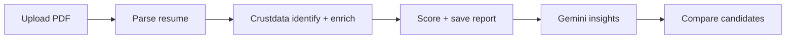

# GrowthLens AI

**GrowthLens AI** is a hiring intelligence app that scores candidates by how much exposure they have had to **high-growth employers**. You upload a PDF resume, the system extracts work history, enriches each employer with live company data from **Crustdata**, computes a **Growth Exposure Score (0–100)**, and generates AI hiring insights with **Google Gemini**. You can manage candidates and compare **2–10** analyzed profiles side by side.

---

## What it does

| Capability | Description |
|------------|-------------|
| **Resume upload** | PDF upload; name and email extracted on upload |
| **Work history parsing** | Jobs, employers, dates from the resume (Gemini primary, regex fallback) |
| **Employer enrichment** | Match companies in Crustdata; headcount growth, funding, industry |
| **Growth Exposure Score** | 0–100 score + band (low → very high growth exposure) |
| **AI insights** | Hiring summary and signals (startup/enterprise readiness, etc.) |
| **Compare** | Rank 2–10 analyzed candidates; recommended hire + narrative |
| **Candidate management** | List, edit profile, delete |

---

## How it works (end-to-end)



### 1. Upload (`POST /api/candidates/upload`)

- Stores the PDF on disk and creates a candidate in **PostgreSQL** (Supabase via Prisma).
- Extracts **name** and **email** from the PDF (heuristics; Gemini if name is missing).

### 2. Analyze (`POST /api/candidates/analyze`)

Runs the full pipeline for one candidate:

1. **Parse resume** — PDF text → structured experiences (company, role, dates).
2. **Crustdata** — For each employer: `identify` by name → `enrich` for headcount/funding.
3. **Score** — Per-employer score from growth + funding + tenure; weighted **Growth Exposure Score**.
4. **AI** — Gemini writes summary and hiring signals from the score data.
5. **Persist** — Experiences, `CompanyGrowth` cache, `GrowthReport`; status `completed`.

### 3. Compare (`POST /api/candidates/compare`)

- Uses **already saved** analyze results (no new Crustdata calls).
- Ranks candidates by score, then avg 6m employer growth, then tenure.
- Gemini (or template fallback) produces a short hiring recommendation.

---

## Tech stack

| Layer | Technology |
|-------|------------|
| **Frontend** | Next.js 16 (App Router), React 19, Tailwind CSS v4, JavaScript |
| **Backend** | Node.js, Express 5, Prisma |
| **Database** | PostgreSQL (Supabase) |
| **Cache** | Redis (optional; Crustdata identify/enrich caching) |
| **Employer data** | [Crustdata API](https://docs.crustdata.com/) |
| **AI** | Google Gemini (`gemini-2.5-flash-lite` by default) |

---

## Crustdata integration

Crustdata provides **company-level** B2B data. GrowthLens does **not** use a “compare candidates” endpoint from Crustdata; comparison is built in-app from scores saved during analyze.

### APIs used

| Crustdata endpoint | Purpose in GrowthLens |
|--------------------|------------------------|
| `POST /company/identify` | Resolve resume employer names → `crustdata_company_id` |
| `POST /company/enrich` | Headcount growth (6m / 12m YoY), funding, basic info |

**Auth:** `Authorization: Bearer <CRUSTDATA_API_KEY>`  
**Version header:** `x-api-version: 2025-11-01` (configurable via `CRUSTDATA_API_VERSION`)

**Behavior:**

- Results cached in Redis and PostgreSQL (`company_growth`) to reduce API usage.
- Unresolved employers become **warnings**; analyze can still complete with partial data.
- Rate limiting and retries on the backend (~4s between Crustdata calls).

Implementation: `backend/src/clients/crustdataClient.js`, `backend/src/services/growthAnalysisService.js`.

---

## Google Gemini (AI)

**Default model:** `gemini-2.5-flash-lite` (set in `backend/.env` as `GEMINI_MODEL`).

Configured in `backend/src/config/env.js`; used via `@google/generative-ai` with JSON response mode where applicable.

| Use case | Service | Fallback if API fails / no key |
|----------|---------|--------------------------------|
| **Resume parsing** | `llmResumeExtractor.js` — work history extraction | Regex/heuristic parser |
| **Hiring insights** | `llmService.js` — summary + signals after scoring | Template from score metrics |
| **Compare narrative** | `llmService.js` — recommendation for ranked list | Template comparing scores |

Resume parsing is **LLM-first** when `GEMINI_API_KEY` is set; regex is used if the model fails or returns no experiences.

---

## Growth Exposure Score

Each job on the resume gets an **employer score** from:

| Factor | Weight | Source |
|--------|--------|--------|
| 6-month headcount growth | 35% | Crustdata |
| 12-month headcount growth | 25% | Crustdata |
| Total funding | 15% | Crustdata |
| Tenure at employer | 25% | Resume dates |

The candidate’s **overall score** is a tenure-weighted average across enriched employers.

| Score range | Band | UI label (example) |
|-------------|------|---------------------|
| 0–30 | `stable` | Low growth exposure |
| 31–60 | `moderate` | Moderate growth exposure |
| 61–80 | `fast` | High growth exposure |
| 81–100 | `hypergrowth` | Very high growth exposure |

Logic: `backend/src/utils/scoreCalculator.js`.

---

## REST API (backend)

Base URL: `http://localhost:8000` (or your `PORT` in `backend/.env`).

| Method | Endpoint | Description |
|--------|----------|-------------|
| `GET` | `/api/health` | Health check (DB, Redis) |
| `POST` | `/api/candidates/upload` | Upload PDF (`resume`), optional `linkedinUrl` |
| `POST` | `/api/candidates/analyze` | Run full analyze pipeline |
| `GET` | `/api/candidates` | List candidates (`?limit=100`) |
| `GET` | `/api/candidates/:id` | Candidate + experiences + report |
| `PATCH` | `/api/candidates/:id` | Update `name`, `email`, `linkedinUrl` |
| `DELETE` | `/api/candidates/:id` | Delete candidate + resume file |
| `POST` | `/api/candidates/compare` | Compare 2–10 completed candidates |

### Compare request body

```json
{
  "candidateIds": [
    "uuid-candidate-1",
    "uuid-candidate-2",
    "uuid-candidate-3"
  ]
}
```

Response includes `winnerId`, ranked `comparison.candidates` (with `rank`), and `comparison.recommendation`.

More detail: [backend/README.md](backend/README.md).

---

## Frontend routes

| Route | Purpose |
|-------|---------|
| `/` | Upload resume |
| `/candidates` | All candidates — view, edit, delete |
| `/candidates/[id]` | Profile, run analyze, view results |
| `/compare` | Multi-select compare (2–10) |

Setup: [frontend/README.md](frontend/README.md).

---

## Quick start (full stack)

### Prerequisites

- Node.js 18+
- PostgreSQL (Supabase connection strings)
- [Crustdata API key](https://crustdata.com/)
- [Google Gemini API key](https://aistudio.google.com/apikey)
- Optional: Docker for Redis (`backend/docker compose up -d`)

### Backend

```bash
cd backend
npm install
cp .env.example .env
# Fill: DATABASE_URL, DIRECT_URL, CRUSTDATA_API_KEY, GEMINI_API_KEY
npm run db:generate
npm run db:migrate
npm run dev
```

Default: `PORT=8000` in `.env` (or `3001` — match `NEXT_PUBLIC_API_URL` in frontend).

### Frontend

```bash
cd frontend
npm install
cp .env.local.example .env.local
# NEXT_PUBLIC_API_URL=http://localhost:8000
npm run dev
```

Open **http://localhost:3000**.

### Typical flow

1. **Upload** a PDF on the home page.
2. Open the candidate → **Analyze candidate** (30–60 seconds).
3. Review Growth Exposure Score, employer breakdown, and AI insights.
4. **Compare** multiple completed candidates on `/compare`.

---

## Environment variables

### Backend (`backend/.env`)

| Variable | Required | Description |
|----------|----------|-------------|
| `DATABASE_URL` | Yes | Supabase Postgres (pooler) |
| `DIRECT_URL` | Yes | Direct Postgres URL (migrations) |
| `CRUSTDATA_API_KEY` | Yes* | Crustdata API access |
| `GEMINI_API_KEY` | No** | Gemini; fallbacks if missing |
| `GEMINI_MODEL` | No | Default `gemini-2.5-flash-lite` |
| `REDIS_URL` | No | Cache; app works without Redis |
| `PORT` | No | API port (e.g. `8000`) |

\* Required for meaningful employer enrichment.  
\** Insights and resume parse use templates/heuristics without Gemini.

### Frontend (`frontend/.env.local`)

| Variable | Description |
|----------|-------------|
| `NEXT_PUBLIC_API_URL` | Backend base URL (e.g. `http://localhost:8000`) |

---

## Project structure

```
crustdata_assign/
├── README.md                 # This file
├── backend/                  # Express API
│   ├── src/
│   │   ├── clients/crustdataClient.js
│   │   ├── services/         # parse, enrich, score, compare, LLM
│   │   └── routes/
│   └── prisma/               # Schema & migrations
└── frontend/                 # Next.js UI
    └── src/
        ├── app/              # Pages
        └── components/
```

---

## Scripts

| Location | Command | Description |
|----------|---------|-------------|
| Backend | `npm run dev` | Start API |
| Backend | `npm test` | Unit tests |
| Backend | `npm run test:crustdata` | Manual Crustdata resolve test |
| Frontend | `npm run dev` | Start UI |
| Frontend | `npm run build` | Production build |

---

## License & attribution

Built as a full-stack assignment/demo integrating **Crustdata** employer intelligence and **Google Gemini** for parsing and hiring narratives. Crustdata data is subject to their API terms and usage limits.
